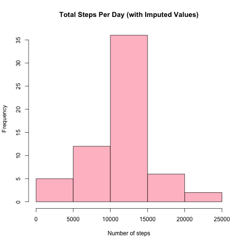

# Reproducible Research: Peer Assessment 1

## Loading and preprocessing the data

```r
# Load required libraries
library(xtable)

# Unzip the data file
unzip("activity.zip")

# Read the data set into R
act.data <- read.csv("activity.csv", colClasses=c("numeric", "Date", "numeric"))

# Set plotting to single panel
par(mfrow=c(1,1))
```

## What is mean total number of steps taken per day?

```r
# Count steps per day
total.daily.steps <- aggregate(act.data$steps, by=list(act.data$date), sum)

# Load ggplot2
library(ggplot2)

# Plot histogram of steps taken daily
ggplot(total.daily.steps,
       aes(x=x)) + geom_histogram(binwidth=3000,
                                  color='black',
                                  fill='white')
```
 

```r
# Calculate summary statistics for total steps per day
summary.stats <- summary(total.daily.steps$x)
mean.daily.steps <- summary.stats["Mean"]
median.daily.steps <- summary.stats["Median"]
```

The **mean total steps per day** is **1.08 &times; 10<sup>4</sup>**  
The **median total steps per day** is **1.08 &times; 10<sup>4</sup>**

## What is the average daily activity pattern?
## What is the average daily activity pattern?

```r
y <- list(as.factor(data$interval))
mean.by.5 <- aggregate(data$steps, y, mean, na.rm = T)
names(mean.by.5) <- c("interval", "mn")

plot(mean.by.5$interval, mean.by.5$mn, type = "n")
lines(mean.by.5$interval, mean.by.5$mn)
max.point <- mean.by.5[which(mean.by.5$mn == max(mean.by.5$mn)), ]
points(max.point, pch = 4, cex = 2, col = "red")
```
 

5'-interval with max steps in avg across all days: 835 with 206.1698 steps in average.

## Imputing missing values

```r
# Calculate and report the total number of missing values in the dataset 
# (i.e. the total number of rows with NAs)
missing.count <- sum(!complete.cases(act.data))
```

The total number of rows with missing values is **2304**.  

**Imputation method used:**  
Missing step values in an interval were filled-in with the mean number of
steps for that specific (5-minute) interval.


```r
# Fill-in missing data with the mean for the 5-minute interval.
# Create a new dataset that is equal to the original dataset but with 
# the missing data filled in.
filled.in.data <- act.data
for (i in 1:nrow(act.data)) {
    if (is.na(act.data$steps[i])) {
        filled.in.data$steps[i] <- mean.per.interval.steps[as.character(filled.in.data$interval[i])]
    } 
}

# Make a histogram of the total number of steps taken each day.
new.total.daily.steps <- tapply(filled.in.data$steps, filled.in.data$date, sum)
hist(new.total.daily.steps,main="Total Steps Per Day (with Imputed Values)", 
     xlab="Number of steps", col="pink")
```

 

```r
# Calculate and report the mean and median total number of steps taken per day. 
new.summary.stats <- summary(new.total.daily.steps)
new.mean.daily.steps <- new.summary.stats["Mean"]
new.median.daily.steps <- new.summary.stats["Median"]

# Print the summary statistics for total steps per day
print(new.summary.stats)
```

```
##    Min. 1st Qu.  Median    Mean 3rd Qu.    Max. 
##      41    9820   10800   10800   12800   21200
```

The mean total steps per day is **1.08 &times; 10<sup>4</sup>**.  
The median total steps per day is **1.08 &times; 10<sup>4</sup>**.  


```r
# Create a data frame to hold the summaries of the original data set
# and the filled-in data set
cmp.df <- data.frame(rbind(summary.stats[1:6], new.summary.stats),
                     row.names=c("Original", "Filled-in (imputed)"))
cmp.df[, names(summary.stats[7])] <- c(summary.stats[7], 
                     sum(!complete.cases(filled.in.data)))
names(cmp.df) <- names(summary.stats)
# Use xtable to make a pretty display
cmp.table <- xtable(cmp.df, display=c("s", "d", "d", "d", "d", "d", "d", "d"),
                    caption="Total Steps Per Day Summary")
print(cmp.table, type="html", caption.placement="top")
```

<!-- html table generated in R 3.1.0 by xtable 1.7-3 package -->
<!-- Thu Jul 17 09:05:49 2014 -->
<TABLE border=1>
<CAPTION ALIGN="top"> Total Steps Per Day Summary </CAPTION>
<TR> <TH>  </TH> <TH> Min. </TH> <TH> 1st Qu. </TH> <TH> Median </TH> <TH> Mean </TH> <TH> 3rd Qu. </TH> <TH> Max. </TH> <TH> NA's </TH>  </TR>
  <TR> <TD align="right"> Original </TD> <TD align="right">  41 </TD> <TD align="right"> 8840 </TD> <TD align="right"> 10800 </TD> <TD align="right"> 10800 </TD> <TD align="right"> 13300 </TD> <TD align="right"> 21200 </TD> <TD align="right">   8 </TD> </TR>
  <TR> <TD align="right"> Filled-in (imputed) </TD> <TD align="right">  41 </TD> <TD align="right"> 9820 </TD> <TD align="right"> 10800 </TD> <TD align="right"> 10800 </TD> <TD align="right"> 12800 </TD> <TD align="right"> 21200 </TD> <TD align="right">   0 </TD> </TR>
   </TABLE>

<br>
**Comparison between original data set and filled-in data set:**  
- The original and filled in data sets have the same *min*, *max*,
  and *mean* values.  
- The *median* of the filled-in data set is only very slightly bigger than
  the original data set.  
- The two data sets differ in their *1st quartile* and *3rd quartile* values.

## Are there differences in activity patterns between weekdays and weekends?

```r
library(lattice)
data$weekend <- weekdays(data$date) %in% c("Saturday", "Sunday")
data[data$weekend == T, ]$weekend <- "Weekend"
data[data$weekend == F, ]$weekend <- "Weekday"
gs <- list(as.factor(data$interval), as.factor(data$weekend))
completed.mean.by.5 <- aggregate(data$steps, gs, mean, na.rm = T)
names(completed.mean.by.5) <- c("interval", "weekend", "mn")
xyplot(mn ~ as.numeric(as.vector(completed.mean.by.5$interval)) | weekend, type = "l", 
    data = completed.mean.by.5, layout = c(1, 2), xlab = "interval in day", 
    ylab = "mean # of steps")
```
 
